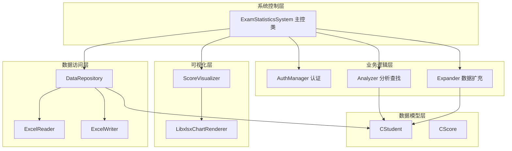
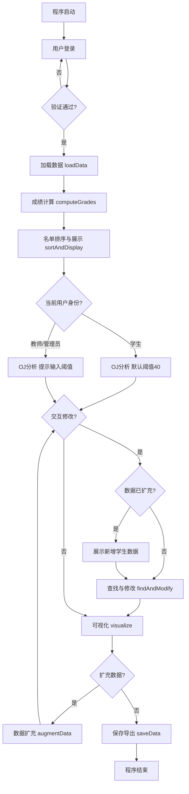
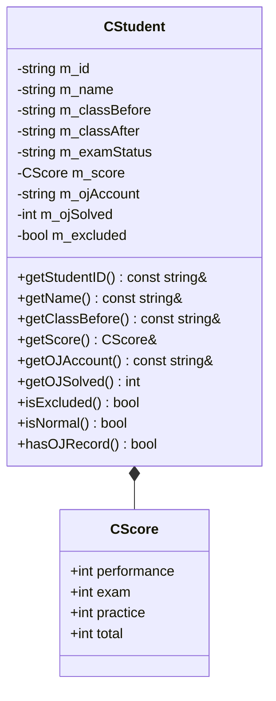
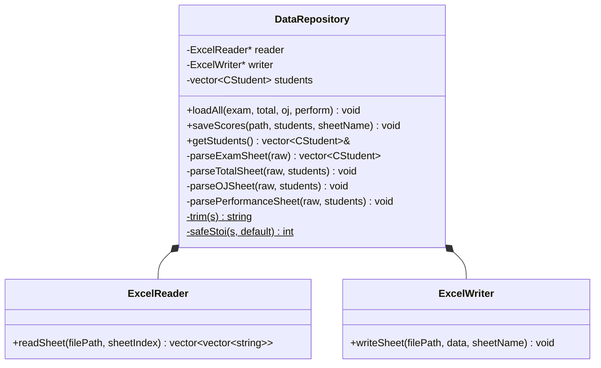
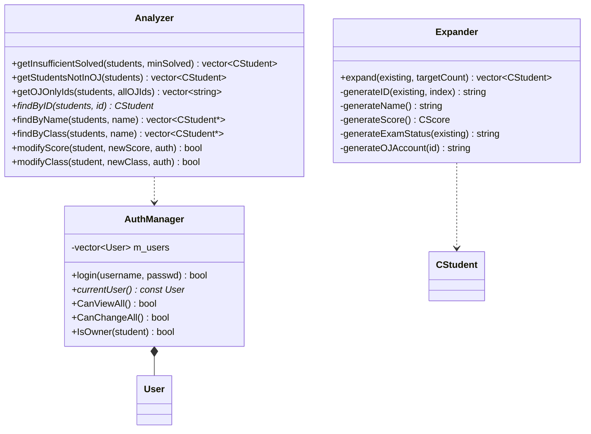
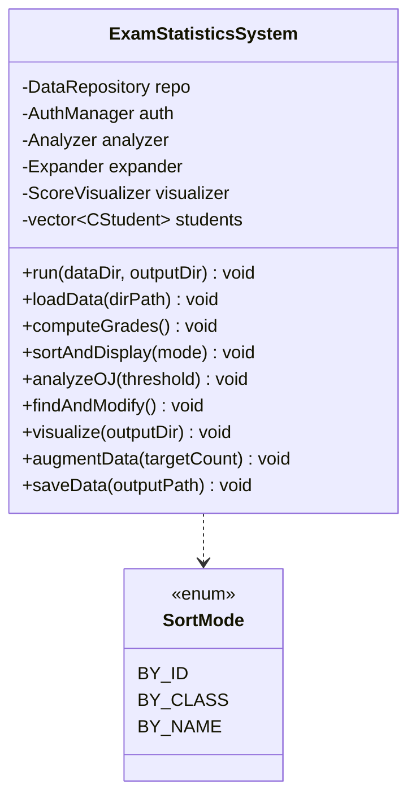
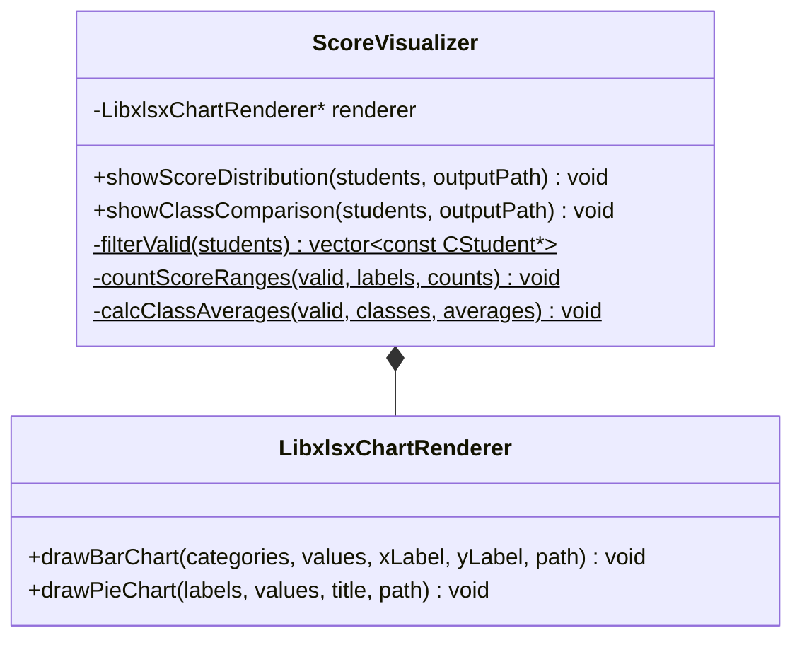

# 西北农林科技大学信息工程学院
# 面向对象程序设计实践实习报告

---

**题　目：** 期末成绩信息统计系统的设计与实现

| | |
|---|---|
| **学　　号** | （填写学号） |
| **姓　　名** | （填写姓名） |
| **专业班级** | （填写专业班级） |
| **指导教师** | （填写指导教师） |
| **实践日期** | 202X年X月X日 — 202X年X月X日 |

---

## 目　录

一、综合训练目的与要求
二、综合训练任务
三、总体设计
四、详细设计说明
　4.1 数据模型层设计
　4.2 数据访问层设计
　4.3 业务逻辑层设计
　4.4 系统控制层设计
　4.5 可视化层设计
五、调试与测试
六、实习日志
七、AI使用情况说明
八、实习总结
九、附录：核心代码清单

---

## 一、综合训练目的与要求

### 1.1 训练目的

本次面向对象程序设计实践旨在综合运用C++面向对象程序设计课程所学知识，通过完整的软件开发流程，将类的抽象与封装、继承与多态、UML建模等理论知识应用于实际问题的求解。具体而言，本次实践的目标包括：

（1）掌握面向对象需求分析与系统设计方法，能够从实际问题中识别对象、抽象类、建立类间关系并绘制UML类图；

（2）熟练运用C++语言实现多文件、分层次的项目结构，遵循高内聚低耦合的设计原则；

（3）学会集成第三方C/C++库（如OpenXLSX、libxlsxwriter），理解库的编译、链接与部署流程；

（4）培养撰写规范技术文档的能力，包括需求说明、设计文档、测试报告与实习总结。

### 1.2 训练要求

根据课程安排，本次实践需满足以下要求：

（1）系统采用面向对象程序设计方法完成，核心代码量不少于500行（使用AI辅助编程时不少于1000行），C风格代码将作为扣分项；

（2）系统须包含文件读写功能，初始数据不少于100个数据元素，并对数据有效性进行合理验证；

（3）项目以多文件形式组织，源码管理推荐使用Git；

（4）提交内容包括源代码、readme说明文档、答辩报告、实施计划书和实习论文，实习论文须包含个人感悟。

---

## 二、综合训练任务

本课题为"期末成绩信息统计系统"，面向高校教师与教务管理人员，实现从Excel文件读取学生成绩数据、自动计算总评成绩、基于OJ刷题数据进行分析、交互式查找与修改学生信息、数据可视化以及成绩导出等功能。

系统具体功能需求如下：

（1）**用户登录与权限验证**：支持学生、教师、管理员三种角色，不同角色拥有不同的数据查看与修改权限；

（2）**数据加载与解析**：从四个Excel文件（卷面成绩、总评成绩单、OJ刷题数据、平时成绩）中读取数据，完成字段解析与合并；

（3）**成绩计算**：按照总评 = 平时成绩×30% + 卷面成绩×70% 的规则自动计算每位学生的总评成绩；

（4）**名单排序与展示**：支持按学号、班级、姓名三种方式对学生列表进行排序并展示；

（5）**OJ系统分析**：统计过题不足的学生、未录入OJ系统的学生及OJ中的独立学号。学生用户自动使用默认阈值40，教师和管理员可自定义过题数阈值；

（6）**交互式查找与修改**：支持按学号/姓名/班级查找学生，并可修改成绩与班级信息，修改后自动重新计算总评。位于修改-可视化-扩充主循环中，数据扩充后自动回到此处；扩充后首次进入修改模式时，自动展示新增学生数据供用户参考；

（7）**数据可视化**：生成分数段分布饼图与班级平均分对比柱状图，以Excel图表形式输出；

（8）**数据扩充**：基于现有学生数据的统计分布自动生成模拟数据，将学生总数扩充至目标人数。扩充完成后自动返回修改界面，允许对新数据继续操作；

（9）**成绩导出**：将完整成绩汇总导出为Excel文件。

> （此处可根据小组分工情况，简要说明本人负责的具体模块及其在整体系统中的位置。）

---

## 三、总体设计

### 3.1 系统架构

系统采用分层架构设计，自底向上依次为数据访问层、业务逻辑层、系统控制层和可视化层，数据模型层贯穿各层。各层职责明确，层间通过接口交互，有效降低了耦合度。

### 3.2 程序主流程

程序启动后按固定流程依次执行各功能模块。OJ分析环节根据用户身份区分阈值设定方式（学生使用默认值，教师和管理员可自定义）。修改、可视化与扩充构成主循环——数据扩充完成后自动返回修改界面，进入修改前先展示新增学生数据以供参考，允许对新增数据继续编辑，直至用户选择跳过扩充进入保存导出。

### 3.3 开发环境与工具

| 项目 | 说明 |
|------|------|
| 编程语言 | C++17 |
| 构建系统 | CMake 3.16+ |
| 编译器 | MinGW-w64 GCC 15.2 / MSVC 2022 |
| 包管理器 | vcpkg |
| 第三方库 | OpenXLSX（Excel读写）、libxlsxwriter（图表生成） |
| 版本管理 | Git + GitHub |
| UML工具 | Mermaid / （填写实际使用工具） |

---

## 四、详细设计说明

### 4.1 数据模型层设计

数据模型层定义了系统核心数据结构，包含学生类 `CStudent` 和成绩结构体 `CScore`。其中 `CStudent` 以组合方式包含 `CScore`，体现"has-a"关系。

`CStudent` 类封装了学生的全部属性——学号、姓名、原班级、分流后班级、考试状态、成绩、OJ账号与过题数——并提供了完整的getter/setter接口。此外，`isExcluded()` 用于标记重修/缓考/旷考等无效学生，`isNormal()` 判断是否为正常参加考试的学生，`hasOJRecord()` 判断是否有OJ刷题记录。这些辅助方法将状态判断逻辑封装在类内部，提高了代码的可读性与可维护性。

> （此处可补充：为何将CScore设计为独立结构体而非直接内嵌字段的设计考量；isExcluded与isNormal的设计意图等，根据个人理解添油加醋。）

### 4.2 数据访问层设计

数据访问层负责封装Excel文件的底层读写细节，向上层提供统一的数据接口。该层包含三个类：`ExcelReader` 封装OpenXLSX的读取操作，`ExcelWriter` 封装写入操作，`DataRepository` 组合二者并负责字段映射与异常处理。

`DataRepository` 是数据访问层的门面（Facade），对外暴露 `loadAll()` 和 `saveScores()` 两个核心接口：`loadAll()` 依次调用四个私有的解析函数（`parseExamSheet`、`parseTotalSheet`、`parseOJSheet`、`parsePerformanceSheet`），将分散于四个Excel文件中的数据合并为统一的 `vector<CStudent>`；`saveScores()` 将内存中的学生列表写回Excel文件。内部还提供了 `trim()` 和 `safeStoi()` 两个静态工具方法，用于处理Excel单元格中的空白字符和非法数值。

> （此处可补充：为何使用指针组合而非直接包含对象的设计选择；OpenXLSX集成过程中遇到的编译链接问题及解决过程等。）

### 4.3 业务逻辑层设计

业务逻辑层包含三个核心模块：认证管理（`AuthManager`）、数据分析与查找（`Analyzer`）和数据扩充（`Expander`）。

**AuthManager类**：管理系统的用户认证与权限控制。内部维护一个用户列表 `m_users`，通过 `login()` 方法验证用户名和密码。`User` 基类定义了 `canViewAll()`、`canChangeAll()`、`canModifyScore()`、`isOwner()` 四个纯虚函数，由 `StudentUser`、`TeacherUser`、`AdminUser` 三个派生类分别实现。身份区分完全依赖多态：学生 `canViewAll()=false`，教师 `canViewAll()=true` 且 `canChangeAll()=false`，管理员两者均为 `true`。主控类通过 `auth.CanViewAll()` 判断用户身份，例如学生用户的 OJ 分析自动使用默认阈值 40 而不提示输入。

**Analyzer类**：提供学生数据的分析、查找与修改功能。`getInsufficientSolved()` 筛选过题数不足阈值的学生；`getStudentsNotInOJ()` 找出有卷面成绩但未录入OJ系统的学生；`getOJOnlyIds()` 返回OJ系统中存在但学生列表中不存在的独立学号；`findByID()`、`findByName()`、`findByClass()` 提供三种维度的查找接口；`modifyScore()` 和 `modifyClass()` 在权限验证通过后执行修改操作。

**Expander类**：基于现有学生的统计分布（成绩均值与标准差、考试状态比例）自动生成模拟数据，实现数据扩充。内部包含 `generateID()`、`generateName()`、`generateScore()` 等一系列生成方法，每个方法负责生成一个维度的模拟数据，体现了单一职责原则。

> （此处可补充：为何将查找功能放在Analyzer而非单独建类的设计权衡；AuthManager的权限模型设计思路；Expander中随机生成的统计合理性考量等。）

### 4.4 系统控制层设计

`ExamStatisticsSystem` 是系统的调度核心，持有数据仓库、认证管理器、分析器、扩充器和可视化器等所有模块的实例，负责按照预设流程协调各模块的调用。

主控类对外仅暴露 `run(dataDir, outputDir)` 一个入口方法，该方法内部按顺序调用：`loadData()` → `computeGrades()` → `sortAndDisplay()` → `analyzeOJ()`（学生默认阈值40，教师/管理员提示输入）→ 主循环 { 若已扩充则展示新增学生 → `findAndModify()`（可选）→ `visualize()` → `augmentData()`（可选，若扩充则回到循环起点）} → `saveData()`。通过 `countBeforeExpand` 变量追踪扩充前后人数差异，在进入修改模式前判断是否有新增数据并予以展示。`readMenuChoice()` 方法封装了用户输入的读取与校验，确保菜单选择的健壮性。

排序功能通过 `SortMode` 枚举（BY_ID/BY_CLASS/BY_NAME）配合三个静态比较函数 `compareByID()`、`compareByClass()`、`compareByName()` 实现，利用了 `std::sort` 与函数指针的组合，体现了策略模式的思想。

> （此处可补充：为何选择组合而非继承来整合各模块的设计理由；主控流程中各步骤顺序设计的考量等。）

### 4.5 可视化层设计

可视化层负责将统计数据生成为带有嵌入式图表的Excel工作簿。`ScoreVisualizer` 负责业务层面的数据过滤与统计，`LibxlsxChartRenderer` 负责底层图表绘制。

`ScoreVisualizer` 的 `filterValid()` 方法排除重修、缓考、旷考等无效学生；`countScoreRanges()` 将总评成绩按标准划分为五个分数段并统计各段人数；`calcClassAverages()` 按班级计算总评平均分。处理完毕后，将结果传递给 `LibxlsxChartRenderer` 的 `drawPieChart()` 或 `drawBarChart()` 方法。

`LibxlsxChartRenderer` 封装了libxlsxwriter C库的调用细节：创建工作簿与工作表、写入表头与数据、构造Excel公式字符串指定图表数据范围、调用图表接口插入嵌入式图表。两个绘制方法均包含参数校验与异常处理，确保在数据异常时给出明确的错误提示。

> （此处可补充：libxlsxwriter集成过程中遇到的编译与链接问题；UCRT locale设置对中文文件名的影响及解决过程；饼图与柱状图的视觉设计考量等。）

---

## 五、调试与测试

### 5.1 编译与构建调试

在项目构建过程中遇到以下主要问题并逐一解决：

（1）**vcpkg triplet不匹配问题**：初次构建时使用MSVC编译的x64-windows triplet链接MinGW编译器，导致大量 `undefined reference to __imp__` 链接错误。经排查发现vcpkg的默认三元组为MSVC ABI，MinGW需使用 `x64-mingw-dynamic` 三元组单独编译依赖库。解决方案是在CMake配置中添加 `-DVCPKG_TARGET_TRIPLET=x64-mingw-dynamic` 参数，并在CMakeLists.txt中增加MinGW编译器自动检测逻辑。

（2）**libxlsxwriter头文件缺失问题**：vcpkg的x64-mingw-dynamic版libxlsxwriter安装包缺少 `third_party/queue.h` 和 `third_party/tree.h` 等内部依赖头文件，导致编译失败。经分析确认这是vcpkg打包的已知缺陷，解决方式为在CMakeLists.txt中添加配置阶段自动补全逻辑：检测到缺失时，从x64-windows版本复制所需头文件。

（3）**中文文件名创建失败问题**：在未安装MinGW的干净Windows系统上运行程序时，libxlsxwriter调用 `fopen` 创建含中文字符的文件时报"`Illegal byte sequence`"错误。根因是C运行时的locale默认为系统ANSI编码（如GBK），而源码中的中文路径为UTF-8编码。解决方案为在 `main()` 函数中添加 `setlocale(LC_ALL, ".utf8")`，使C运行时文件I/O统一使用UTF-8编码。

（此处可根据实际调试经历补充更多问题及解决过程。）

### 5.2 功能测试

| 测试项 | 测试内容 | 预期结果 | 实际结果 |
|--------|----------|----------|----------|
| 登录验证 | 分别以学生/教师/管理员身份登录 | 赋予不同权限 | （填写） |
| 数据加载 | 加载四个Excel文件 | 正确解析并合并数据 | （填写） |
| 成绩计算 | 验证总评=平时×0.3+卷面×0.7 | 计算结果正确 | （填写） |
| OJ分析 | 统计过题不足/未录入OJ/独立学号 | 分类正确 | （填写） |
| 查找修改 | 按学号/姓名/班级查找并修改 | 查找到正确学生，修改后总评重算 | （填写） |
| 图表生成 | 生成饼图与柱状图 | 输出可正常打开的xlsx文件 | （填写） |
| 数据扩充 | 扩充至100人 | 生成数据分布合理 | （填写） |
| 成绩导出 | 导出一份汇总xlsx | 内容完整、格式正确 | （填写） |

---

## 六、实习日志

| 日期 | 工作内容 | 遇到的问题 | 解决方式 |
|------|----------|------------|----------|
| 第1天 | 小组讨论选题、需求分析、初步设计 | （填写） | （填写） |
| 第2天 | 搭建项目结构、集成OpenXLSX库 | （填写） | （填写） |
| 第3天 | 实现数据模型层与数据访问层 | （填写） | （填写） |
| 第4天 | 实现业务逻辑层（认证、分析、扩充） | （填写） | （填写） |
| 第5天 | 实现系统控制层与主流程串联 | （填写） | （填写） |
| 第6天 | 集成libxlsxwriter、实现可视化层 | （填写） | （填写） |
| 第7天 | 调试与测试、修复编码问题 | （填写） | （填写） |
| 第8天 | 准备答辩材料、撰写实习报告 | （填写） | （填写） |
| 第9天 | 答辩 | — | — |
| 第10天 | 根据反馈修改完善报告 | （填写） | （填写） |

> （以上为建议时间线，请根据实际情况修改日期、内容和遇到的问题。）

---

## 七、AI使用情况说明

### 7.1 AI工具使用概况

在本次面向对象程序设计实践中，本人使用了以下AI工具辅助开发：

| 工具名称 | 版本/模型 | 使用环节 |
|----------|-----------|----------|
| （填写工具名称，如GitHub Copilot） | （填写版本或模型） | （填写使用环节） |

### 7.2 AI使用的具体环节与作用

（1）**代码编写**：在编写（哪些模块/类的具体代码）时，使用AI工具辅助生成（具体描述：函数框架/异常处理逻辑/工具方法等）。AI在此环节中帮助提高了编码效率，减少了重复性代码的编写时间。

（2）**问题调试**：在遇到（具体描述什么编译/运行错误）时，向AI工具描述了错误现象与相关上下文，AI提供了（具体描述：根因分析/可能的解决方向/修复代码）。在此过程中，本人对AI给出的方案进行了（验证/修正/补充），最终解决了问题。

（3）**思路梳理**：在设计（哪个模块/算法）时，与AI讨论了（设计思路/数据结构选型/接口定义），AI提供了（建议/参考方案/备选思路），帮助本人理清了设计方向。

（4）**文档撰写**：在撰写（实习报告/答辩PPT/readme文档）时，使用AI辅助（生成初稿/润色语言/检查格式）。

### 7.3 AI生成代码占比

经统计，本次实践中AI直接生成的代码约占项目总代码量的XX%（请如实填写），AI辅助提示下自行编写的代码约占XX%。所有AI生成的代码均经过本人的审查、理解与必要修改。

### 7.4 使用AI过程中的问题与思考

在使用AI辅助编程的过程中，本人有以下体会与反思：

（1）（填写：AI的局限性。例如：AI对特定库的版本差异不够了解，建议的代码有时无法直接编译通过；AI对复杂业务逻辑的理解需要多次对话澄清等。）

（2）（填写：个人的收获。例如：AI加快了编码速度，但代码质量仍需开发者把控；通过与AI的交互，学到了新的C++语法特性/设计模式等。）

（3）（填写：对AI辅助编程的认识。例如：AI是工具而非替代品，理解代码的逻辑和设计意图仍然是开发者的核心职责。）

> （本节内容请务必如实填写，要求包含具体细节和个人真实思考，避免空洞套话。）

---

## 八、实习总结

### 8.1 技术收获

通过本次面向对象程序设计实践，本人在以下方面有了切实的提升：

（1）**面向对象设计能力**：从最初的概念层面理解"封装、继承、多态"，到亲手设计包含5个层次、10余个类的完整系统，对类的职责划分、接口设计、组合与继承的选择有了更直观的认识。特别是在设计`DataRepository`门面类和`ExamStatisticsSystem`主控类时，深刻体会到"高内聚、低耦合"原则对代码可维护性的影响。

（2）**工程实践能力**：完整经历了"需求分析→系统设计→编码实现→集成第三方库→编译调试→打包发布"的软件开发全流程。在CMake构建配置、vcpkg包管理、MinGW与MSVC的ABI兼容性等问题上积累了实操经验，这些是在纯理论课程中难以获得的。

（3）**问题排查能力**：面对编译链接错误、运行时编码错误等实际问题时，学会了从错误信息出发，结合工具链特性（如编译器ABI、C运行时locale）逐层排查根因，而非盲目尝试。

### 8.2 不足与改进方向

（1）（填写：如代码中某些模块的设计仍有改进空间，例如XXX类的接口不够简洁、XXX函数职责不够单一等。）

（2）（填写：如测试覆盖不够充分，仅进行了基本功能测试，缺少边界条件和异常输入的测试。）

（3）（填写：如时间安排不够合理，导致XXX环节比较仓促。）

### 8.3 个人感悟

（填写：对两周集中实践的个人感受——团队协作中的收获与磨合、时间压力下的效率提升、看到自己亲手写的程序真正运行起来的成就感、对未来学习方向的思考等。此部分应真实、具体，避免套话。）

---

## 九、附录：核心代码清单

以下列出本人负责编写的核心代码文件及其主要功能：

| 文件名 | 功能简述 | 代码行数（约） |
|--------|----------|:--:|
| `CStudent.h` / `CStudent.cpp` | 学生数据模型，封装属性与状态判断方法 | XX |
| `DataRepository.h` / `DataRepository.cpp` | 数据仓库，协调Excel读写与字段解析 | XX |
| `ExcelReader.h` / `ExcelReader.cpp` | OpenXLSX读取封装 | XX |
| `ExcelWriter.h` / `ExcelWriter.cpp` | OpenXLSX写入封装 | XX |
| `AuthManager.h` / `Auth.cpp` | 用户认证与权限管理 | XX |
| `Analyzer.h` / `Analyzer.cpp` | 数据查找与OJ分析 | XX |
| `Expander.h` / `Expander.cpp` | 数据扩充与模拟生成 | XX |
| `ExamStatisticsSystem.h` / `ExamStatisticsSystem.cpp` | 系统主控，流程调度 | XX |
| `ScoreVisualizer.h` / `ScoreVisualizer.cpp` | 可视化数据预处理 | XX |
| `LibxlsxChartRenderer.h` / `LibxlsxChartRenderer.cpp` | libxlsxwriter图表绘制封装 | XX |
| `main.cpp` | 程序入口，参数解析与环境初始化 | XX |

> （注：请根据本人实际负责的模块调整上表，仅列出本人编写的文件。）

---

*— 报告结束 —*
